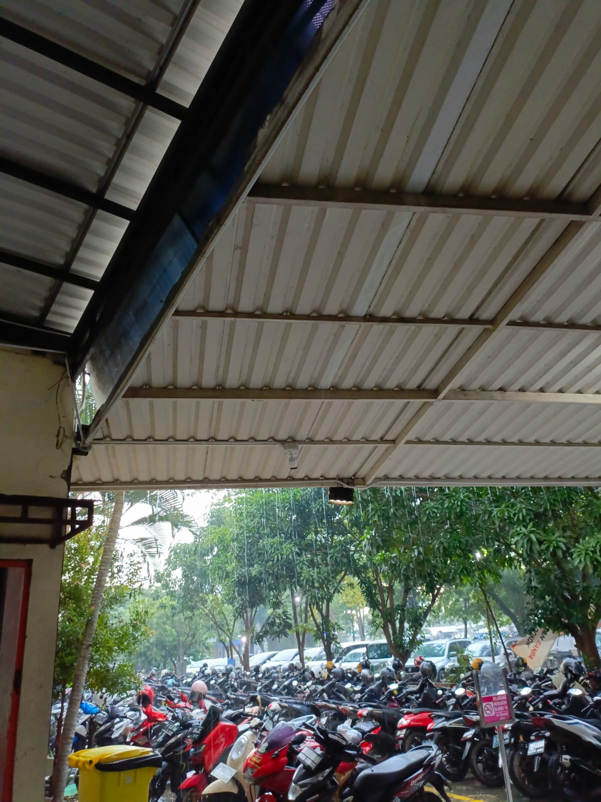

# PROFIL
## UTS Pemrograman Web

#### 

| Variable           |       isi           |
| -------------------|---------------------|
| **Nama**           | Ananda Rahmadani    |
| **NIM**            | 312310461           |
| **Kelas**          | TI.23.A.5           |
| **Mata Kuliah**    | Pemrograman Web     |

### Membuat Website-Dinamis
### langkah-langkah
### 1. Membuat file website-dinamis

### 2. Menjalankan  MySQL server

# Mengakses Apache Client menggunakan "website-dunamis".
pastikan webserver Apache sudah dijalankan. kemudian untuk mengakses direktory tersebut pada web server dengan mengakses URL:
http://localhost/website-dinamis/?page=home

# 3. Membuat index: membuat webssite-dinamis

# membuat tampilan dalam

<!doctype html>
<html lang="en">

<head>
    <meta charset="utf-8">
    <meta name="viewport" content="width=device-width, initial-scale=1">
    <title>Bootstrap demo</title>
    <!-- Bootstrap -->
    <link href="assets/css/bootstrap.min.css" rel="stylesheet">

    <!-- Datatables -->
    <link href="assets/datatables/dataTables.dataTables.css" rel="stylesheet">
</head>

<body>
    <header>
        <h1 class="text-center p-3">Membuat website dinamis</h1>
        <!-- navbar -->
        <?php include "includes/navbar.php" ?>
        <!-- ./navbar -->

        <!-- konten -->
        

            <?php include "konten.php"?>
        

        <!-- konten -->

        <footer class="bg-dark text-white text-center py-3 mt-5">
            

                

                    

                        <h5>Kontak Kami</h5>
                        
Email: lutpiahainus@gmail.com

                        
Telepon: (+62) 823-3345-6789

                    

                    

                        <h5>Ikuti Kami</h5>
                        <a href="#" class="text-white me-2"><i class="bi bi-facebook"></i></a>
                        <a href="#" class="text-white me-2"><i class="bi bi-twitter"></i></a>
                        <a href="#" class="text-white"><i class="bi bi-instagram"></i></a>
                    

                    

                        <h5>Lokasi</h5>
                        
Jl. maju, Kota Mundur

                        
Indonesia

                    

                

                

                    <small>&copy; 2024 Website Dinamis. All rights reserved.</small>
                

            

        </footer>

        
        

        

        

</body>

</html>

# Menambahkan data navbar

<nav class="navbar bg-dark navbar-expand-md bg-body-tertiary" data-bs- theme="dark">

    

        <a class="navbar-brand" href="?page=home">Navbar</a>
        <button class="navbar-toggler" type="button" data-bs-toggle="collapse" data-bs-target="#navbarSupportedContent"
            aria-controls="navbarSupportedContent" aria-expanded="false" aria- label="Toggle navigation">

            
        </button>
        

            <ul class="navbar-nav me-auto mb-2 mb-lg-0">
                <li class="nav-item">
                    <a class="nav-link active" aria-current="page" href="?page=home">Home</a>
                </li>
                <li class="nav-item">
                    <a class="nav-link" href="?page=about">About</a>
                </li>
                <li class="nav-item">
                    <a class="nav-link" href="?page=contact">Contact</a>
                </li>

                <li class="nav-item dropdown">
                    <a class="nav-link dropdown-toggle" href="#" role="button" data-bs-toggle="dropdown"
                        aria-expanded="false">
                        Belajar
                    </a>
                    <ul class="dropdown-menu">
                        <li><a class="dropdown-item" href="?page=datatables">Datatables</a></li>

                        <li><a class="dropdown-item" href="?page=form">form</a></li>

                        <li>
                            

                        </li>
                        <li><a class="dropdown-item" href="#">Something else here</a></li>

                    </ul>
                </li>
            </ul>
            <form class="d-flex" role="search">
                <input class="form-control me-2" type="search" placeholder="Search" aria-label="Search">

                <button class="btn btn-outline-success" type="submit">Search</button>

            </form>
        

    

</nav>

# outputnya ketika berhasil:

# 3. Menambahkan Home
dengan memasukan halaman Home

<h1>Halaman Home</h1>

    

        
        <!-- Card 1 -->
        

            

                
                

                    <h5 class="card-title">Cisco Networking Academy</h5>
                    
program tanggung jawab sosial perusahaan (CSR) internasional 
                        yang bertujuan membantu siswa dan pendidik mengembangkan keterampilan untuk pekerjaan di bidang teknologi informasi.

                    <a href="https://www.netacad.com/courses/networking-basics?courseLang=en-US" class="btn btn-primary">Go somewhere</a>
                

            

        

        <!-- Card 2 -->
        

            

                
                

                    <h5 class="card-title">Git Hub</h5>
                    
platform berbasis web yang digunakan untuk mengelola dan menyimpan kode sumber perangkat lunak
                        GitHub menggunakan sistem kontrol versi Git dan layanan hosting internet.

                    <a href="https://github.com/dashboard" class="btn btn-primary">Go somewhere</a>
                

            

        

    

# 4. Menambahkan about
dengan memasukan image dan carousel dari :

http://localhost/website-dinamis/?page=about

<h1>Halaman about</h1>
<!DOCTYPE html>
<html lang="id">

<head>
    <meta charset="UTF-8">
    <meta name="viewport" content="width=device-width, initial-scale=1.0">
    <title>Profil - Ananda Rahmadani</title>
    
</head>

<body>
    
    

        <!-- Foto Profil -->
        

        <!-- Nama dan Universitas -->
        <h2 class="profile-name">Ananda Rahmadani</h2>
        
Jl. Pelita , Kota Bangsa

    

    

        

            <button type="button" data-bs-target="#carouselExampleCaptions" data-bs-slide-to="0" class="active"
                aria-current="true" aria-label="Slide 1"></button>
            <button type="button" data-bs-target="#carouselExampleCaptions" data-bs-slide-to="1"
                aria-label="Slide 2"></button>
            <button type="button" data-bs-target="#carouselExampleCaptions" data-bs-slide-to="2"
                aria-label="Slide 3"></button>
        

        

            

                
                

                    <h5>University</h5>
                    
Kalimalang.

                

    

</body>

</html>

# 5. Menambahkan contact
Dengan Memasukan Halaman Contct

<h1>Halaman Contact</h1>
<!DOCTYPE html>
<html lang="en">

<head>
    <meta charset="UTF-8">
    <meta name="viewport" content="width=device-width, initial-scale=1.0">
    <title>Contact</title>
    <link rel="stylesheet" href="https://cdnjs.cloudflare.com/ajax/libs/bootstrap/5.3.0/css/bootstrap.min.css">
</head>

<body>

    

        <h1 class="text-center">Halaman Contact</h1>
        

            

                

                    <h3 class="text-center">Hubungi Kami</h3>
                    

                        
<strong>Email:</strong> <a href="mailto:anandarahmadani859@gmail.com">anandarahmadani859@gmail.com</a>

                        
<strong>Telepon:</strong> <a href="tel:+6281293801571">+62 812-9380-1571</a>

                        

                        
<strong>Ikuti Kami di Media Sosial:</strong>

                        

                            <a href="https://www.instagram.com/nndarhmdnii?igsh=MWdhb3kwZm53N2dmMQ====" target="_blank"
                                class="text-decoration-none text-dark">
                                 Instagram
                            </a>
                            <a href="https://threads.net/Iqbal |" target="_blank"
                                class="text-decoration-none text-dark">
                                 Threads
                            </a>
                        

                    

                

            

        

    

    
</body>
</html>

# Membuat Data Tables Belajar
berikan Skrip untuk Data Tables Belajar yang mengacu pada:
https://datatables.net/examples/basic_init/zero_configuration.html

# Membuat Form Belajar
menambahkan form dari:
https://getbootstrap.com/docs/5.3/forms/overview/#overview

## KAMSIA
